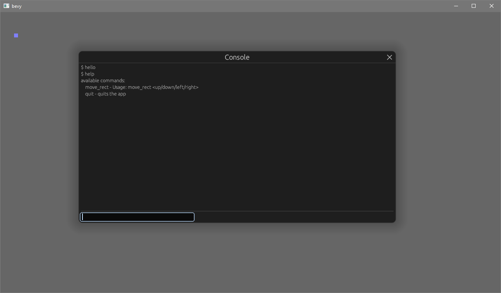

# bevy console

A simple halflife2 style console  
uses egui to draw the console



## Usage
Add `ConsolePlugin` and optionally the resource `ConsoleConfiguration`
```rust
fn main() {
    App::build()
        .add_plugin(ConsolePlugin)
        .insert_resource(ConsoleConfiguration {
            // override config here
            ..Default::default()
        })
}
```
Create a system to listen to console events
```rust
fn listen_to_console_events(
    mut console_events: EventReader<ConsoleCommandEntered>,
) {
    for event in events.iter() {
        // event has 2 fields, commands and args
    }
}
```
If you want to send text to the console:
```rust
fn write_to_console(
    mut console_line: EventWriter<PrintConsoleLine>,
) {
    console_line.send(PrintConsoleLine::new("Hello".to_string()));
}
```
There's more examples in the examples directory, you'll need to enable the `examples` feature to run them though
```
cargo run --example basic_example --features examples
```

## wasm
Should work in wasm, but you need to disable default features
